## Bristin Borah

Full Stack Web3 Developer · Guwahati, India · 4+ years across EVM & Solana

  

## What I Build

- **Privacy-first infrastructure** — zero-knowledge proofs, zkVM execution, and confidential computation that settles on-chain without exposing the underlying data.
- **Protocol & smart contract engineering** — production Anchor programs, sBPF, and Solidity across DeFi, NFTs, GameFi, and restaking, with invariant- and unit-tested coverage.
- **Developer tooling & SDKs** — reusable Rust and TypeScript libraries, CLIs, and validator infrastructure for the people building on top.

## Currently

Building **[Tuniq](https://www.bristinborah.com/)** — a confidential-computation layer on Logos LEZ that runs private predicates with RISC Zero proofs and verifies results on Solana, without ever revealing the inputs.

🏆 Winner of **Logos λPrize LP-0012** (Event/Log Mechanism for LEZ) — and an active contributor across the Logos / IFT ecosystem.

## Stack

**Solana · Rust**&nbsp;&nbsp;`Anchor` `sBPF` `PDAs` `CPIs` `SPL / Token-2022` `RISC Zero zkVM` `Groth16` `litesvm`

**EVM · Solidity**&nbsp;&nbsp;`Foundry` `Ethereum` `Polygon` `BSC` `Celo` `Creditcoin` `Status Network`

**Backend**&nbsp;&nbsp;`Axum` `tokio` `NestJS` `Express` `TypeScript` `GraphQL` `Postgres` `MongoDB` `Redis`

**Frontend**&nbsp;&nbsp;`React` `Next.js` `Tailwind` `ethers.js` `web3.js`

## Selected Work

| Project | What it is |
| --- | --- |
| [**Tuniq**](https://www.bristinborah.com/) | Confidential computation on Logos LEZ; private predicates proven to Solana. |
| [**CredGate Protocol**](https://github.com/bristinWild/CredGate) | Cross-chain credit layer on Creditcoin — turns wallet history into verifiable identity. |
| [**Predicted AI**](https://github.com/bristinWild/predictedAI) | AI platform scoring user intent and likelihood-to-engage for acquisition. |
| **Ozon SDKs** | CLI + operator tooling for a Solana restaking / AVS protocol. |

## Let's build something

Open to full-time Web3 roles, protocol engineering contracts, and long-term technical collaborations. Remote-first, available globally.

---

B.Tech in Computer Science · Certified Blockchain Developer · Independent builder in the Logos ecosystem — not affiliated with the Logos core team.
